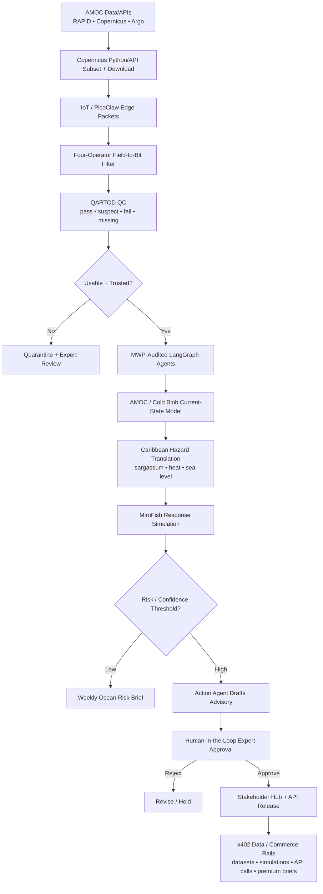

# AMOC Sentinel — Full System Mermaid Diagram

## Purpose
This document preserves the fuller system diagram in Mermaid form so it can be reused in the repo, application materials, or future planning discussions.

This is best treated as a broader future-state / expanded-system diagram rather than the smallest buildathon MVP topology.

## Mermaid diagram

## Scope note
This diagram is intentionally broader than the MVP topology. It is useful for showing the long-term system direction, including:
- edge sensing
- packet filtering
- quality control and trust gates
- simulation
- expert review
- monetized distribution

For the buildathon MVP, the cleaner 3-agent topology should remain the primary architecture visual.
