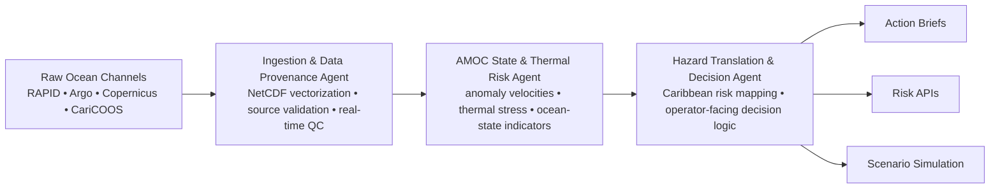

# AMOC Sentinel — MVP System Orchestration Topology

## Purpose
This is the cleaner, submission-ready MVP architecture view for AMOC Sentinel.

It is intended to show the smallest credible end-to-end system for the buildathon:
- upstream ocean and observational data
- ingestion and provenance handling
- AMOC and thermal risk reasoning
- hazard translation and decision outputs

## Mermaid diagram

## Why this version matters
This topology is intentionally smaller than the future-state architecture.

It is meant to show what the MVP actually needs to do:
- ingest trusted data
- validate and structure it
- score AMOC and thermal risk context
- translate that into Caribbean hazard and operator outputs

## Output surfaces

### Action Briefs
Operator-facing summaries and recommended actions.

### Risk APIs
Structured outputs for downstream systems, dashboards, or partner integrations.

### Scenario Simulation
A lighter MVP-facing simulation layer for exploring response paths and projected operational impacts.

## Relationship to future-state architecture
This is the MVP subset.

The larger future-state architecture still includes:
- local edge sensing
- deeper filtering and packetization
- broader simulation layers
- human/expert approval paths
- x402 monetization rails

Those remain part of the north-star system design, but this topology is the one best suited for application materials and first implementation.
